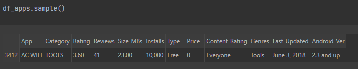
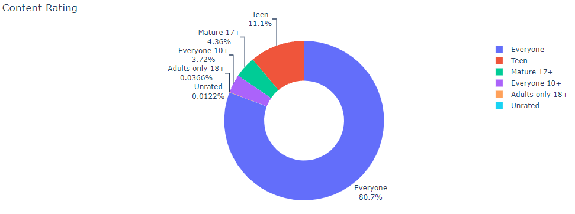
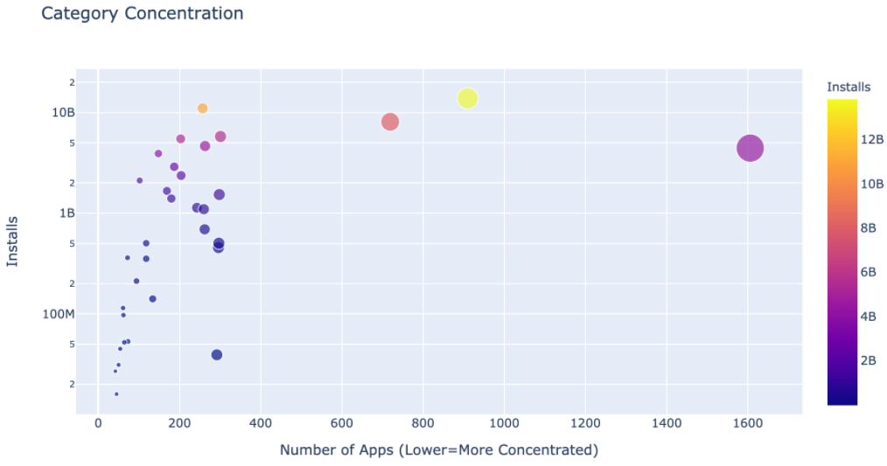
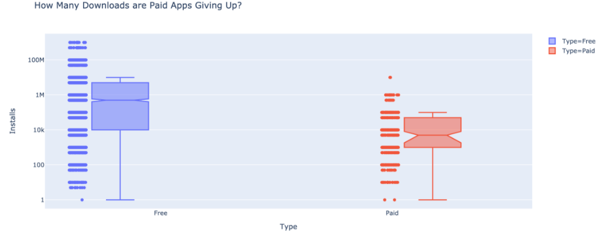

# DataAnalys_AndroidStore
> Combine Android App Store Data with Charts from Plotly.

## Table of contents
* [General info](#general-info)
* [Screenshots](#screenshots)
* [Technologies](#technologies)
* [Setup](#setup)
* [Status](#status)

## General info
It is one of the Data Analysing projects which is suppoused to hone my skills in that category.

Main goals of the project were:
* Learn how to remove duplicates.
* Romove unwanted symbols and convert data into numeric format.
* Wrangle columns containing nested data with pandas.
* Create vertical, horizontal and grouped bar charts.
* Create pie and donut charts for categorical data.
* Use colour scale to make scatter plots look better.

As a notebook I used Datalore from Jetbrains.

App and review data was scraped from the Google Play Store by Lavanya Gupta in 2018. [Original data](https://www.kaggle.com/lava18/google-play-store-apps).

It's one of the projects from [Angela's Python Bootcamp](https://www.udemy.com/course/100-days-of-code/)

## Screenshots

## Technologies
* Python 3.8
* Pandas 1.3.3
* Plotly 4.14.3

## Setup
Import notebook and data from csv file into one of the Data Science Notebooks (f.e. Datalore).

## Status
Project is: _finished_.
